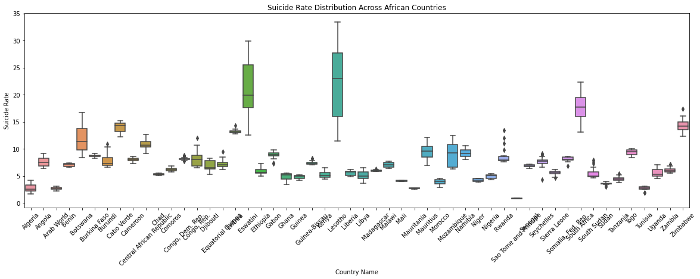
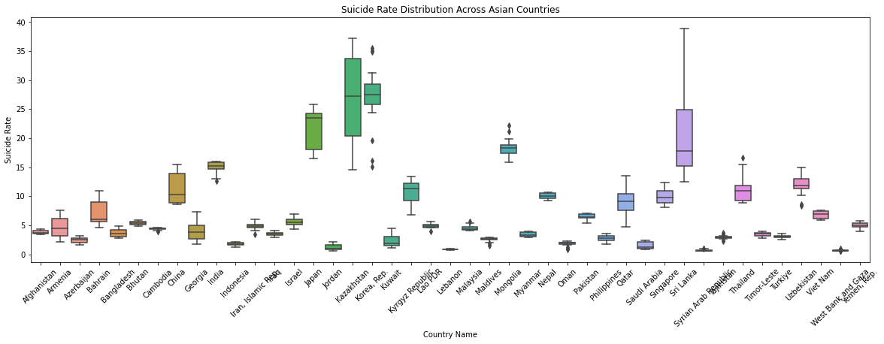
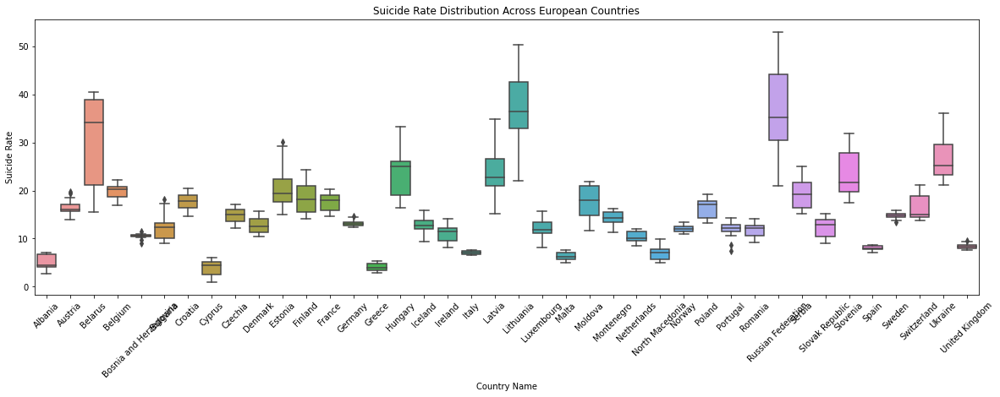
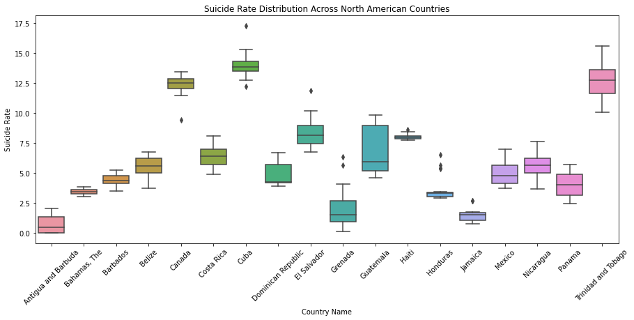
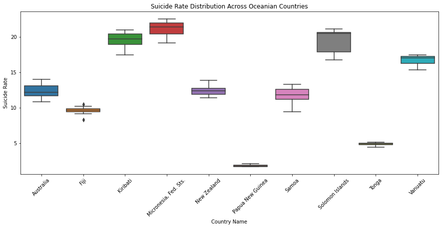
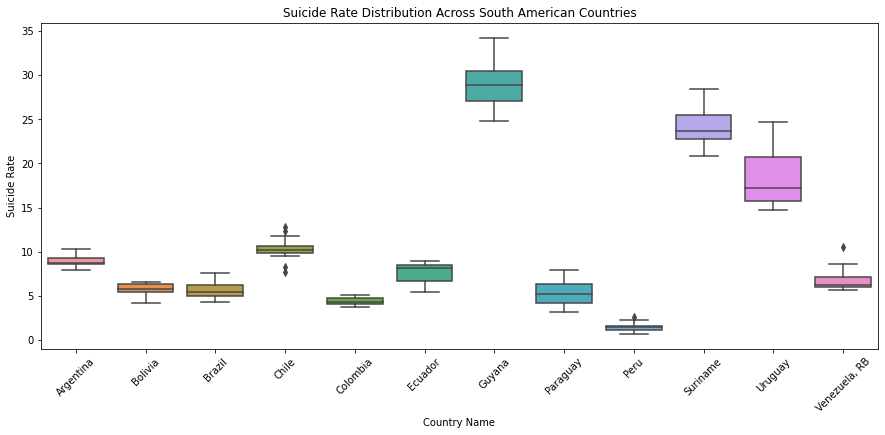

## Project Title
Suicide Rate Analysis by Country and Continent

## Project Overview
- The dataset contains suicide rates by countries over multiple years ranging from 2000 to 2021. Feature engineering was used to create continents for better analysis.
- Goal: Basic Exploratory Data Analysis. Exploring trends, patterns and outliers in suicide rates globally and regionally.

## Questions:
1. Which countries and continents have the highest and lowest suicide rates?
2. How have suicide rates changes over time globally and regionally?
3. Are there outlier countries with unusally high or low suicide rates?
4. Are there noticeable regional patterns?

## Key Findings
1. Europe has the highest average suicide rate while North America has the lowest.
2. Republic of Korea has the highest average suicide rate per country while West Bank and Gaza ahs the lowest.
3. There has a been a steady decrease in suicide rates globally over the years.
4. Africa has the highest number of outliers while Oceania has the lowest.
5. Asia has shown a steady decrease in suicide rates over the years.

## Visualizations
- Line Plots  showing trends over time by continent and country.
- )

- Boxplots highlighting distribution and outliers for countries within each continent.
  
  
  
  
  
  

## Conclusion
This analysis highlights global and regional patterns in suicide rates, identifies countries with extreme rates, and provides insight into temporal trends across continents. It can inform further
research on factors influencing suicide and potential intervention strategies. Overall, the suicide rates over the years has been on a steady decrease so researching on factors that influence
this decrease can help further reduce the rates. 

